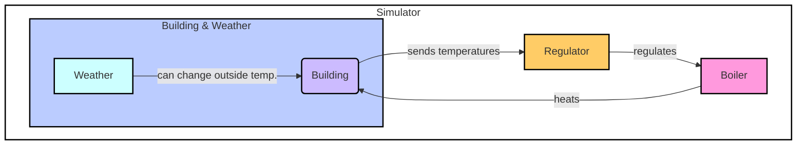

# Boiler Simulator

This project contains the code of a simple boiler simulator, developed in Python, aiming to replicate the main characteristics and behavior of a boiler and the heating of a building.


## Requirements

- Python 3.11 or later
- Poetry (and defined dependencies)
- Tkinter (GUI of Python)
- FastAPI
- Uvicorn


## Project structure

- [app](app): Boiler simulator application.
  - `boiler.py`: Boiler class, which provides heat to the building.
  - `building.py`: Building class, which measures its temperature and sends it to the regulator.
  - `constants.py`: Constants values.
  - `instances.py`: Instances of the classes (Boiler, Building, Regulator, Weather).
  - `main.py`: Main file to run the simulation.
  - `models.py`: Models of the data used by the FastAPI.
  - `regulator.py`: Regulator class, which adjusts the operating percentage of the boiler based on the measured temperature.
  - `routes.py`: Routes of the FastAPI.
  - `simulator.py`: Simulator class, which manages the interaction between the components. It uses the Tkinter library to display the simulation.
  - `weather.py`: Weather class, which changes the outside temperature of the building by retrieving real weather data from OpenSteetMap and OpenMeteo.
  - `static/index.html`: Contains the HTML template and static files for the frontend.
- [docker](docker): Docker's files to run the simulator into a container.
  - `build.py`: Build the Docker image.
  - `Dockerfile`: Instructions to build the Docker image.
  - `requirements.txt`: Python dependencies.
  - `run.py`: Run the Docker image.
- [test](test): Tests of the simulator.
  - `test_heating_simulator.py`: Tests of the whole simulator.


## Local installation

1. Clone the repository or download the source code:

```shell
git clone https://gitlab.forge.hefr.ch/philippe.marziale/tb-optibot.git
```

2. Create a virtual environment using poetry:

```shell
poetry install
```

3. Activate the virtual environment:

```shell
poetry shell
```

4. Navigate to the project folder:

```bash
cd src/simulator
```

5. Run the simulator:

```shell
python main.py
```


## Docker installation

1. Clone the repository or download the source code:

```shell
git clone https://gitlab.forge.hefr.ch/philippe.marziale/tb-optibot.git
```

2. Install a X server on your host machine (e.g. [XQuartz](https://www.xquartz.org/) on macOS or [VcXsrv](https://sourceforge.net/projects/vcxsrv/) on Windows).


3. Open the X server on your host machine and allow connections from network clients.

4. Allow connections from local applications to the X server by running the following command on your host machine:

```shell
xhost + localhost
```

5. Navigate to the project folder:

```bash
cd src/simulator
```

6. Build the Docker image:

```shell
python docker/build.py
```

7. Run the Docker container:

```shell
python docker/run.py
```


## Usage and functionalities

1. A window will open, displaying the simulator.
2. You can modify as you wish the parameters of the simulation in the simulator window.
3. Or you can use the API to modify the parameters of the simulation (go to the URL displayed in the terminal).
4. You can also use the API to retrieve the data of the simulation.


## Functioning Diagram

Here is a diagram illustrating the functioning of the simulator:



To summarize:
- The Boiler provides heat to the Building.
- The Building measures its temperature and sends it to the Regulator.
- The Regulator adjusts the operating percentage of the Boiler based on the measured temperature.
- The Weather may or may not influence the Building's outside temperature.
- The Simulator manages the interaction between these components.


## Tests

Available in the [test](test) folder, see `README.md` file into the folder for more information.
